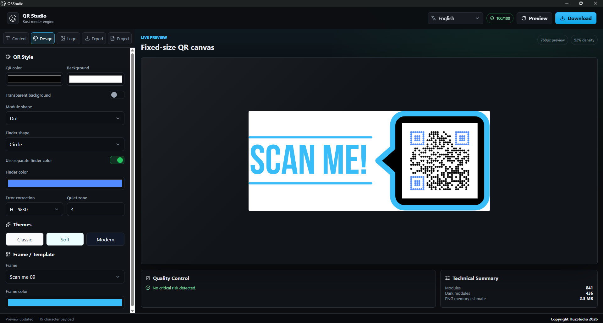

# QR Studio



QR Studio is a polished desktop QR-code design and export application built with React, TypeScript, Vite, and Tauri. It combines a fast, modern frontend with a Rust rendering engine, giving users a practical studio for creating reliable, branded QR codes without depending on a remote service.

The app is designed for real production workflows: build a QR from multiple content types, refine the visual style, add a logo or frame, validate scan quality, and export single or batch assets in common formats.

## Highlights

- Desktop-first QR studio powered by Tauri 2 and a native Rust backend.
- Live QR preview with technical statistics, density reporting, and design warnings.
- Multiple content presets: URL, plain text, Wi-Fi, email, phone, SMS, vCard, calendar event, and geo location.
- Custom visual styling for module shape, finder shape, colors, transparent backgrounds, quiet zone, and error correction level.
- Logo support with sizing, padding, background card color, rounded corners, and circular card mode.
- Built-in frame templates with configurable accent color and frame text.
- Export to PNG, JPG, WebP, SVG, and PDF.
- Multi-size export workflow with native save and folder dialogs.
- CSV batch export for generating many QR assets from `name,payload` rows.
- QR decode test to verify that the generated code can be read back successfully.
- Project save/open support through JSON-based project files.
- Localized interface text for several languages.

## Tech Stack

| Layer | Technology |
| --- | --- |
| Desktop shell | Tauri 2 |
| Frontend | React 19, TypeScript, Vite |
| UI icons | Lucide React |
| Native engine | Rust |
| QR generation | `qrcode` |
| Decode validation | `rqrr` |
| Image processing | `image`, `resvg`, `base64`, `flate2` |
| Dialogs | `rfd` |
| Linting | Oxlint |

## Project Structure

```text
.
|-- public/                 # Static web assets
|-- src/                    # React application
|   |-- App.tsx             # Main studio UI and client-side workflow logic
|   |-- index.css           # Application styling
|   `-- main.tsx            # React entry point
|-- src-tauri/              # Tauri desktop application and Rust engine
|   |-- assets/frames/      # Built-in QR frame SVG templates
|   |-- capabilities/       # Tauri permission configuration
|   |-- icons/              # Desktop bundle icons
|   |-- src/lib.rs          # QR rendering, export, validation, and decode commands
|   |-- src/main.rs         # Native application entry point
|   `-- tauri.conf.json     # Tauri app and bundle configuration
|-- package.json
`-- vite.config.ts
```

## Core Features

### QR Content Builder

QR Studio can generate payloads for common QR use cases:

- Website URLs
- Plain text
- Wi-Fi credentials
- Email drafts
- Phone numbers
- SMS messages
- vCard contact data
- Calendar event data
- Geographic coordinates

The current payload is shown in the interface so users can inspect exactly what will be encoded.

### Design Studio

The design panel exposes practical controls for scan-safe customization:

- Error correction: `L`, `M`, `Q`, `H`
- Quiet zone margin
- Module shape: square, rounded, dot, diamond
- Finder shape: square, rounded, circle
- QR foreground and background colors
- Optional separate finder color
- Transparent background mode
- Built-in theme presets
- Frame templates with custom text and accent color

### Logo Workflow

Users can add PNG, JPG, or WebP logos to the center of the QR code. The Rust backend validates logo input and enforces sensible limits:

- Maximum logo file size: 5 MB
- Maximum decoded logo resolution: 16 MP
- SVG logos are rejected for now
- Large logos trigger scan-safety warnings

Logo rendering includes a configurable backing card, padding, radius, and circular mode to preserve contrast around the brand mark.

### Quality Control

QR Studio includes built-in safeguards for more reliable output:

- Quiet-zone warnings when the margin is too small
- Contrast warnings for low foreground/background contrast
- Payload-density warnings for complex QR matrices
- Logo-size and error-correction warnings
- Export-size warnings for very large raster output
- Decode test that renders the QR and reads it back with `rqrr`

These checks help catch common problems before files are delivered or printed.

### Export System

The native export engine supports:

- `PNG`
- `JPG`
- `WebP`
- `SVG`
- `PDF`

Exports can be generated at multiple sizes. A single export opens a native save dialog; multiple sizes or batch exports open a folder picker and write all generated files there.

Raster exports are guarded by backend limits to avoid accidental oversized renders:

- Maximum raster side: 12,000 px
- Maximum raster pixels: 96 MP
- PDF raster rendering is clamped to 4,096 px for embedded image quality and file safety

### CSV Batch Export

CSV batch mode is intended for production runs. The app accepts either:

```csv
name,payload
homepage,https://example.com
support,mailto:support@example.com
```

or a CSV where the first column is treated as the payload. Batch export is limited to 250 generated files per run, while CSV parsing accepts up to 1,000 rows in the UI.

### Project Files

The project panel can save and open QR Studio project files as JSON. This allows a design configuration to be reused or shared later without rebuilding the QR settings manually.

## Getting Started

### Prerequisites

Install the following before running the project:

- Node.js and npm
- Rust toolchain
- Platform requirements for Tauri 2 on your operating system

### Install Dependencies

```bash
npm install
```

### Run the Web Frontend

```bash
npm run dev
```

This starts Vite on `127.0.0.1:1420`. The browser preview includes a fallback preview, but the full QR rendering engine requires the Tauri runtime.

### Run the Desktop App

```bash
npm run tauri dev
```

This starts the Vite dev server and launches the native Tauri desktop window.

### Build the Frontend

```bash
npm run build
```

### Build the Desktop Bundle

```bash
npm run tauri build
```

Tauri will create platform-specific application bundles according to `src-tauri/tauri.conf.json`.

## Available Scripts

| Command | Description |
| --- | --- |
| `npm run dev` | Start the Vite development server on `127.0.0.1:1420`. |
| `npm run build` | Type-check and build the frontend into `dist/`. |
| `npm run preview` | Preview the built frontend. |
| `npm run lint` | Run Oxlint. |
| `npm run tauri` | Run the Tauri CLI. Use `npm run tauri dev` or `npm run tauri build`. |

## Native Commands

The frontend communicates with the Rust backend through Tauri commands:

| Command | Purpose |
| --- | --- |
| `render_qr_preview` | Generate the live SVG preview and QR statistics. |
| `export_qr_asset` | Generate a single export asset and return it to the frontend. |
| `export_qr_files` | Save one or many export files through native dialogs. |
| `run_qr_decode_test` | Render and decode the QR to verify scanability. |
| `validate_qr_design` | Return design warnings for a given QR configuration and size. |

## Security and Reliability Notes

- QR rendering and export are local-first; generated assets do not require a network service.
- The Tauri content security policy only allows local resources, data/blob images, IPC, and the local IPC endpoint.
- File writes are performed only after native save or folder selection dialogs.
- Logo data is validated before rendering.
- File names are sanitized before batch output is written.
- Export requests are capped to avoid accidental large batch operations.

## Development Notes

- The main frontend state and UI live in `src/App.tsx`.
- The visual system is defined in `src/index.css`.
- The Rust rendering engine lives in `src-tauri/src/lib.rs`.
- Built-in frame SVGs are embedded at compile time from `src-tauri/assets/frames`.
- The app window is configured as a resizable desktop studio with a default size of `1440x920` and a minimum size of `1100x760`.

## License

No license has been specified yet.
